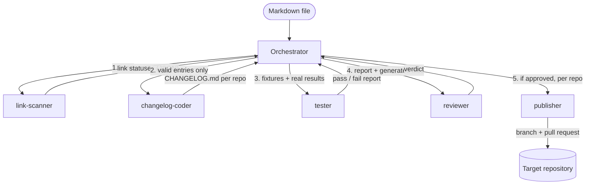

# portfolio-changelog-crew

A multi-agent pipeline, orchestrated with Claude Code, that turns a portfolio markdown
file into pull requests: it finds the GitHub repositories mentioned in the file, verifies
each link, generates a `CHANGELOG.md` from each repository's real commit history, and
opens a pull request with it on the target repository.

## What it does

Given the path to a markdown file (any file — a portfolio tracker, a project index,
anything that mentions GitHub repositories in prose), the pipeline runs five stages:

1. **Extraction & link verification** — every `github.com` URL in the file is pulled
   out and checked over HTTP. Each one is classified as `valid`, `dead` (404/5xx/timeout),
   `malformed` (wrong shape, or a near-miss typo domain), or `no-link` (a project is named
   but no URL is given).
2. **Clone & changelog generation** — each `valid` repository is cloned and its
   `git log` is turned into a `CHANGELOG.md`, grouped chronologically by commit date
   (no invented version numbers when the repo has no tags).
3. **Testing** — the pipeline's behavior on edge cases (dead link, empty repository,
   malformed URL, project mention with no link) is verified against fixtures with known
   expected outcomes.
4. **Review** — the generated code and changelogs are checked against this project's
   conventions and cross-referenced with the test results before anything ships.
5. **Publishing** — for each repository, a branch is created, the generated
   `CHANGELOG.md` is committed and pushed **to that repository** (not to this one), and
   a pull request is opened there, summarizing what was checked and generated. Merging
   is always left to a human.

The tool is deliberately generic: it takes a markdown file path as input and makes no
assumption about which file or which repositories it will see.

## Agentic engineering demonstrated

- **Multi-agent orchestration with Claude Code** — five specialized sub-agents, each
  defined as a standalone prompt in [`.claude/agents/`](.claude/agents/), invoked by an
  orchestrator that sequences them and passes data between stages. No sub-agent invokes
  another: keeping every LLM call under the orchestrator's control keeps the pipeline's
  cost, latency, and behavior predictable.
- **Strict separation of responsibilities** — each agent has exactly one job and a
  documented input/output contract. In particular, the agent that finds problems
  (`tester`) never fixes them itself: it reports, and a different actor decides what to
  do about it, so no agent can convince itself its own output is correct.
- **Per-agent model selection** — Haiku for mechanical, low-ambiguity work (link
  extraction and HTTP classification); Sonnet for anything requiring judgment or
  coherent synthesis (code review, test design, PR descriptions). The choice is made
  per agent based on the nature of its task, not applied uniformly.
- **Project-scoped Skills** — repeatable procedures that don't belong in any single
  agent's contract (the pipeline's call sequence, the workflow for changing a sub-agent)
  are captured as Skills in [`.claude/skills/`](.claude/skills/), kept deliberately short
  to avoid duplicating what's already documented elsewhere.
- **Disciplined git workflow** — no direct commits to `main`; every change lands on a
  dedicated branch and goes through a pull request, opened as soon as a coherent piece
  of work is ready rather than batched into one large PR at the end.

## Architecture

| Sub-agent | Model | Role |
|---|---|---|
| [`link-scanner`](.claude/agents/link-scanner.md) | Haiku | Extracts GitHub links from the input file and classifies each one (`valid` / `dead` / `malformed` / `no-link`). |
| [`changelog-coder`](.claude/agents/changelog-coder.md) | Sonnet | Clones each valid repository and generates a `CHANGELOG.md` from its `git log`. |
| [`tester`](.claude/agents/tester.md) | Sonnet | Designs fixtures for the pipeline's edge cases and grades the real results against them. |
| [`reviewer`](.claude/agents/reviewer.md) | Sonnet | Reviews the generated code/output against this project's conventions and the test report; gives a go/no-go verdict. |
| [`publisher`](.claude/agents/publisher.md) | Sonnet | Pushes each changelog to its target repository and opens a pull request there. |

No sub-agent calls another — the orchestrator is the only actor that invokes them, and
relays each stage's output as the next stage's input:

**Tooling**: GitHub operations (repository creation, branch pushes, pull requests) go
through the `gh` CLI, called directly from the agents' shell commands. This project does
not use a custom MCP server — Claude Code's built-in tools and `gh` cover everything it
needs.

## How to run

**Prerequisites**:
- [Claude Code](https://claude.com/claude-code) installed.
- [`gh` CLI](https://cli.github.com/) installed and authenticated (`gh auth login`) with
  write access to whichever repositories will receive a generated changelog.

**Running a full pipeline pass**: open this project in Claude Code and ask it to run the
pipeline against a markdown file, for example:

> Run the full pipeline on `sample-input/portfolio-snapshot.md`.

The orchestrator will sequence the five sub-agents as described above, asking for
confirmation before any action with real external side effects (pushing a branch,
opening a pull request, changing a repository's visibility). See
[`.claude/skills/run-pipeline`](.claude/skills/run-pipeline/SKILL.md) for the exact
call sequence, and [`CLAUDE.md`](CLAUDE.md) for the project's full conventions.
